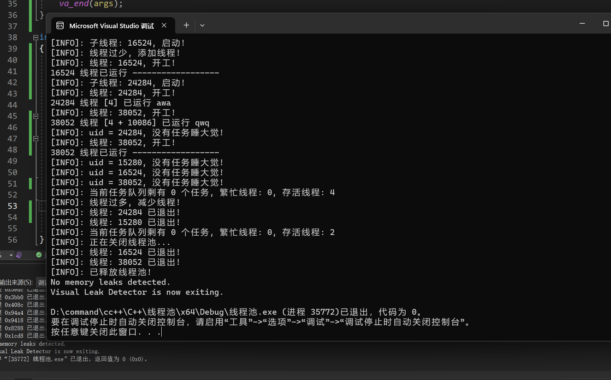
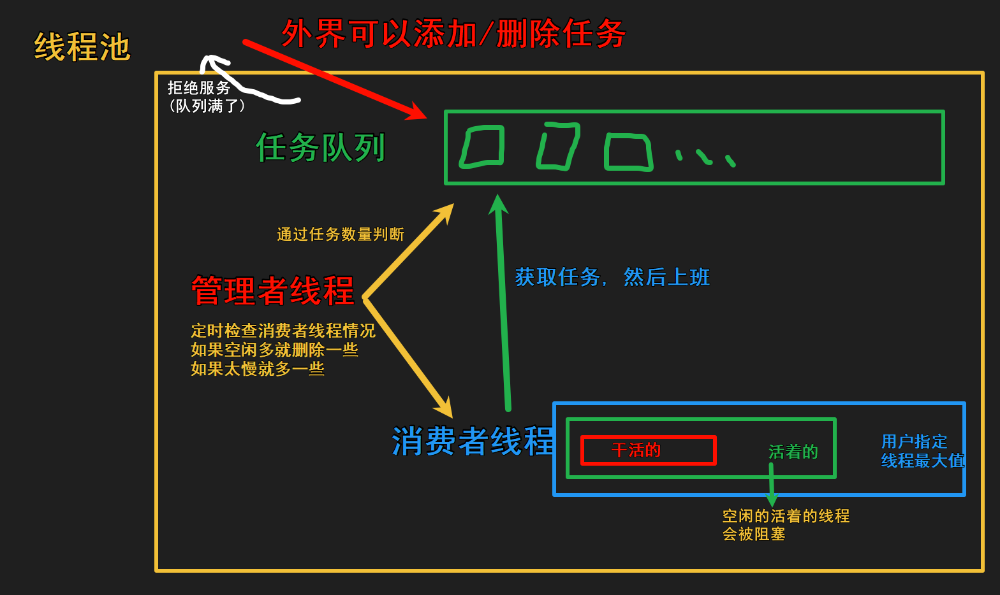
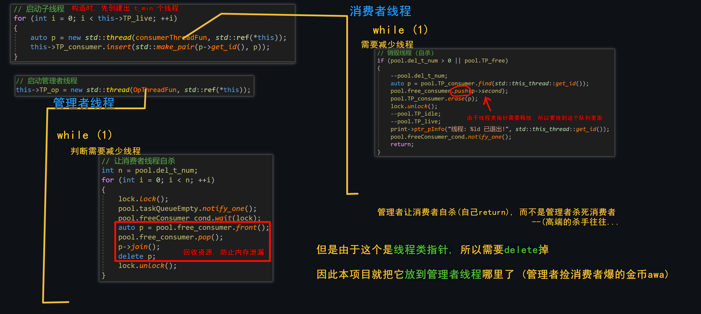

<h1 align="center">HXThreadPool</h1>
Linux, Windows 平台的轻量级C++线程池, 支持可变参数的函数/类方法/仿函数/匿名函数等等, 使用简单, 可自定义线程池增减规则, 日志打印等
代码简单, 不过几百行.
<p align="center">|<a href="https://996.icu"></a>|<a href="https://github.com/HengXin666/ThreadPool"></a>|<a href="https://github.com/HengXin666/ThreadPool"></a>|<a href="https://github.com/HengXin666/ThreadPool"></a>|<a href="https://github.com/HengXin666.com">HX</a>|
</p>

## 1. 安装

### 1.1. 下载源码
```shell
git clone https://github.com/HengXin666/ThreadPool.git
```

### 1.2. 找到需要的文件

`code`目录下 >> `HXThreadPool.h` 和 `HXThreadPool.cpp`

## 2. 使用
### 2.1. 引入头文件
```c++
#include <cstdio>
#include "HXThreadPool.h" // 我的线程池文件
```

### 2.2. 简单使用
```c++
int main() {
    // 创建线程池
	HX::ThreadPool pool(2);

    // 可以使用匿名函数/仿函数/函数, 并且参数数量/类型不限
    pool.addTask([](int a, int b) { printf("hello world! %d + %d = %d\n", a, b, a + b); }, 1, 2);

    return 0;
}
```

使用示例图:



本程序已经使用 `#include "vld.h"` 检测内存泄漏情况, 目前没有发现内存泄漏.

### 2.3. Linux 编译

(注:) **需要链接`pthread`库才可以使用!**

```shell
g++ -std=c++11 main.cpp HXThreadPool.cpp -l pthread -o app
```

## 3. 线程池类函数说明
### 3.1. 线程池的创建

简单的使用, 只需要指定`最小线程数`(`t_min`)即可 (`opTime`(检查 消费者线程 的时间间隔)或许也需要你的指定)

```c++
// 为什么需要核心数 - 1?, 因为 还有主线程 (-1); 还有一个管理者线程 (-1), 但是因为有时间间隔, 所以可以忽略...
/**
 * @brief 创建线程池并初始化, [-1] 代表使用 (当前CPU的核心数 - 1)
 * @param t_min 最小线程数
 * @param t_max 最大线程数
 * @param taskMaxSize 最大任务数
 * @param opTime 管理者线程 检查 消费者线程 的时间间隔, 单位 ms
 */
ThreadPool(int t_min, int t_max = -1, int taskMaxSize = -1, int opTime = 2000);
```

### 3.2. 给线程池添加任务

你可以添加任务, 任务可以是函数, 也可以是类方法, 也可以是仿函数, 也可以是lambda函数等等, 并且参数数量/类型不限

- *如果您希望获得函数的返回值, 请使用引用或者指针作为参数传入*

```c++
/**
 * @brief 给线程池添加任务
 * @param func 子线程需要执行的任务可调用对象
 * @param ... 可调用对象分别对应的参数, 若没有可以为空 (只写参数func)
 * @return 添加成功 1, 出错 0
 */
template<typename Function, typename... Args>
bool addTask(Function&& func, Args&&... args);

template<typename Function>
bool addTask(Function&& func);
```

### 3.3. 查看线程池状态

如下所示

```c++
/**
 * @brief 获取当前线程池忙碌的线程数
 * @param 无
 * @return 忙碌的线程数
 */
int getPoolBusySize();

/**
 * @brief 获取当前线程池存活的线程数
 * @param 无
 * @return 存活的线程数
 */
int getPoolLiveSize();

/**
 * @brief 获取当前线程池的任务队列的长度
 * @param 无
 * @return 任务队列的长度
 */
int getTaskSize();
```

### 3.4. 关闭线程池

您可以手动关闭, 也可以使用析构函数

```c++
// 销毁线程池
void freeThreadPool();
~ThreadPool();
```

## 4. 更多 自定义内容
### 4.1. 指定线程池增减规则

您可以指定线程池增减规则, 也可以不指定, 默认的规则是: 

- `任务的个数 > 存活的线程个数 && 存活的线程数 < 最大线程数` 则**增加**线程

- `忙的线程 * 2 < 存活的线程数 && 存活的线程 > 最小线程数` 则**减少**线程

只需要配置`函数指针`即可

```c++
/**
 * @brief 设置管理者线程判断函数
 * @param addPtr 单次增加的线程的判断函数
 * @param subPtr 单次减小的线程的判断函数
 * @return 无
 */
void setSinglFunPtr(bool (*addPtr)(int, int, int, int, int, int, int) = ifAddThread ,
                    bool (*subPtr)(int, int, int, int, int, int, int) = ifSubThread );
```

#### 函数指针参数介绍

函数指针 执行 的函数, 其参数的顺序规定如下:

- *注: 不论有没有使用, 在判断的时候均会进行下面参数的传参*

示例:
```c++
/**
 * @brief 自带的增加线程数量 判断函数
 * @param now_taskSize 当前任务数
 * @param now_busy 当前繁忙的线程
 * @param now_idle 当前闲置的线程
 * @param now_live 当前存活的线程
 * @param t_min    线程池的最小线程数
 * @param t_max	   线程池的最大线程数
 * @param taskMaxSize 任务队列最大长度
 * @return 0 不进行增加 / 1 进行增加
 */
static bool ifAddThread(int now_taskSize, int now_busy, int now_idle, int now_live, int t_min, int t_max, int taskMaxSize);
```

### 4.2 设置线程池单次增减线程数量

默认的线程池单次增减线程数量为 `SINGLE_NUME = 2`

```c++
/**
 * @brief 设置单次增减线程数量
 * @param add 单次增加的线程数量
 * @param sub 单次减小的线程数量
 * @return 无
 */
inline void setSinglNumer(int add = SINGLE_NUME, int sub = SINGLE_NUME);
```

### 4.3 线程池类的成员
```c++
// --- 任务队列 组 ---
std::queue<std::function<void()>> TP_threadTaskQueue;	// 任务队列
int taskMaxSize;			// 任务数量
int opTime;					// 间隔检查时间
std::thread* TP_op;			// 管理者线程

std::mutex TP_mutex_all;					// 整个线程池的互斥锁

std::condition_variable taskQueueFull;		// 条件变量: 任务队列满了
std::condition_variable taskQueueEmpty;		// 条件变量: 任务队列空了
std::condition_variable freeConsumer_cond;	// 条件变量: 需要释放的线程

bool (*ifAddFunPtr)(int, int, int, int, int, int, int); // 函数指针指向是否增加线程的判断函数
bool (*ifSubFunPtr)(int, int, int, int, int, int, int); // 函数指针指向是否减少线程的判断函数

// --- 线程池 信息 ---
int t_min;					// 最小线程数
int t_max;					// 最大线程数
int singleAdd;				// 单次添加的线程数
int singleSub;				// 单次销毁的线程数

std::atomic_int TP_busy;         // 繁忙线程数 (正在执行任务)
std::atomic_int TP_idle;         // 空闲线程数 (已挂起)
std::atomic_int TP_live;         // 存活线程数 == 空闲线程数 + 繁忙线程数
std::atomic_int del_t_num;		 // 目前需要删除的线程数

// --- 线程池 社畜 ---
std::map<std::thread::id, std::thread *> TP_consumer;	// 消费者红黑树 (添加/查找/删除 O(logN) 时间复杂度)
std::queue<std::thread*> free_consumer;					// 需要释放的线程

// --- 线程池 开关 ---
std::atomic_bool TP_free;		// 线程池是否释放
```

### 4.4 自定义日志函数

> [!TIP]
> 注: 这个和本项目[线程池]关系不大, 只不过我为了日后的方便顺手写的 qwq

自定义单例输出类

```c
namespace HX::tools {
    // 单例-饿汉-输出类
    class HXprint {
        HXprint();
    private:
        HXprint(const HXprint&) = delete;
        HXprint& operator =(const HXprint&) = delete;

        // 自带输出正常
        static void printInfo(const char* str, ...);

        // 自带输出异常
        static void printError(const char* str, ...);
    public:
        static HXprint* getHXprint();
        
        // 设置info输出函数
        void setPrintInfoFun(void (*fun)(const char* str, ...));

        // 设置error输出函数
        void setPrintErrorFun(void (*fun)(const char* str, ...));
        
        void (*ptr_pInfo)(const char* str, ...);
        void (*ptr_pError)(const char* str, ...);
    };
}
```

首先, 它是一个单例模型的类, 顾名思义, 整个程序中只有一个实例, 也就是全局的, 也就是你可以在任何地方调用`HX::tools::HXprint::getHXprint()`即可获取到全局的实例.

其实现也非常简单:

```c++
// 构造函数
HX::tools::HXprint::HXprint()
{
	this->ptr_pInfo = printInfo;
	this->ptr_pError = printError;
}

// 获取实例
HX::tools::HXprint* HX::tools::HXprint::getHXprint()
{
	static HXprint hxPrint;
	return &hxPrint;
}
```

关联到的函数指针, 其可以被替换, 以下是默认的函数指针:

```c++
void HX::tools::HXprint::printInfo(const char* str, ...)
{
	va_list args;
	va_start(args, str);

	// 构建输出字符串
	char buffer[CACHE_STR_ARR_SIZE_MAX];
	vsnprintf(buffer, sizeof(buffer), str, args);

	printf("[INFO]: %s\n", buffer);
	va_end(args);
}
```

使用它, 就如使用`printf()`一样:
```c++
auto print = HX::tools::HXprint::getHXprint();
print->ptr_pInfo("我被使用啦%s~", ">v<"); // 打印 "[INFO]: 我被使用啦>v<~\n" 于控制台
```

如果你把它改为在日志函数中打印, 那么只需要:

```c++
void myPrint(const char* str, ...)
{
	va_list args;
	va_start(args, str);
    // -----------------------上面不能改

	// 构建输出字符串 (组装可变参数到字符串buffer中)
	char buffer[CACHE_STR_ARR_SIZE_MAX];
	vsnprintf(buffer, sizeof(buffer), str, args);

    // ------------------------上面最好不要改
    // 随便你发挥


    // 此处可以是你的日志函数 fprintf() 等等
	printf("[DEBUG]: %s\n", buffer);

    // -----------------------下面不能改
	va_end(args);
}

int main()
{
    // 绑定新的输出函数
	HX::tools::HXprint::getHXprint()->setPrintInfoFun(myPrint);
    // ...
}
```

## 5. 线程池原理与实现
### 5.1 前置知识
我们使用线程的时候就去创建一个线程，这样实现起来非常简便，但是就会有一个问题：如果并发的线程数量很多，并且每个线程都是执行一个时间很短的任务就结束了，这样频繁创建线程就会大大降低系统的效率，因为频繁创建线程和销毁线程需要时间。

那么有没有一种办法使得**线程可以复用，就是执行完一个任务，并不被销毁，而是可以继续执行其他的任务**呢？

线程池是一种多线程处理形式，处理过程中将任务添加到队列，然后在创建线程后自动启动这些任务。线程池线程都是后台线程。每个线程都使用默认的堆栈大小，以默认的优先级运行，并处于多线程单元中。如果某个线程在托管代码中空闲（如正在等待某个事件）,则线程池将插入另一个辅助线程来使所有处理器保持繁忙。如果所有线程池线程都始终保持繁忙，但队列中包含挂起的工作，则线程池将在一段时间后创建另一个辅助线程但线程的数目永远不会超过最大值。超过最大值的线程可以排队，但他们要等到其他线程完成后才启动。

在各个编程语言的语种中都有线程池的概念，并且很多语言中直接提供了线程池，作为程序猿直接使用就可以了，下面给大家介绍一下线程池的实现原理：

线程池的组成主要分为3个部分，这三部分配合工作就可以得到一个完整的线程池：

- <span style="color:red">任务队列，存储需要处理的任务，由工作的线程来处理这些任务</span>
	- 通过线程池提供的API函数，将一个待处理的任务添加到任务队列，或者从任务队列中删除
	- 已处理的任务会被从任务队列中删除
	- 线程池的使用者，也就是调用线程池函数往任务队列中添加任务的线程就是生产者线程
- <span style="color:red">工作的线程（任务队列任务的消费者），N个</span>
	- 线程池中维护了一定数量的工作线程, 他们的作用是是不停的读任务队列, 从里边取出任务并处理
	- 工作的线程相当于是任务队列的消费者角色，
	- 如果任务队列为空, 工作的线程将会被阻塞 (使用条件变量/信号量阻塞)
	- 如果阻塞之后有了新的任务, 由生产者将阻塞解除, 工作线程开始工作
- <span style="color:red">管理者线程（不处理任务队列中的任务），1个</span>
	- 它的任务是周期性的对任务队列中的任务数量以及处于忙状态的工作线程个数进行检测
	- 当任务过多的时候, 可以适当的创建一些新的工作线程
	- 当任务过少的时候, 可以适当的销毁一些工作的线程



注意, 任务队列满了不一定是拒绝服务, 也有可能阻塞等待任务队列

### 5.2 本项目的实现

主要是一些感觉上是与众不同的点:

- 消费者线程の销毁: 虽然线程会退出, 但是因为是 `std::thread *` 的类型, 所以还需要 `delete` 一下, 因此把它放进去 `std::queue<std::thread*> free_consumer`里面, 并且在**管理者线程**把它销毁, 以防止内存泄漏.



其他的可以查看代码, 自认为我的注释还算可以的qwq...

## 6. 小结
这是我开发的轻量级C++线程池, 目的是为了巩固刚刚学习的`C++11`多线程编程(线程池/互斥锁/条件变量/原子操作等)

我现在只是一名大一的学生(2024年1月30日), 代码可能写的很不好, 但希望你能理解. 如果出现了BUG, 希望您给我反馈, 这也是我的宝贵的学习机会!

如果可以的话, 请给我一个star, 谢谢!

## 7. 更新日志
- 2024.01.30:
    - 写好了这个东西...
